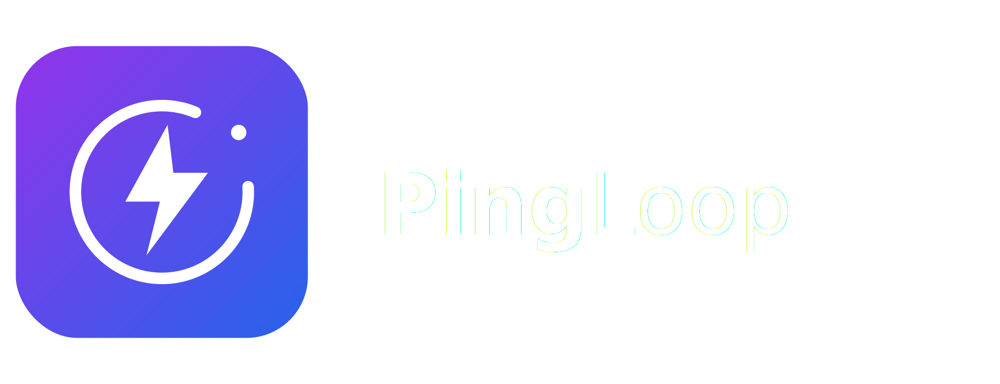

<p align="center">
  
</p>

Simple recurring reminders, timers, and productivity nudges that run fully in
your browser. No backend, no account, no database. Your data stays on your
device, and the app works offline after the first load.

PingLoop is built with Vite, React, and TypeScript, and ships as a static site
you can host on GitHub Pages.

## The three concepts

PingLoop has one mental model with three parts:

- **Timers**: countdowns that beep and notify when they reach zero, like a 25
  minute study timer. Start, pause, reset, delete.
- **Reminders**: one-time nudges at a specific date and time, like "call the
  dentist". They fire once.
- **Pings**: repeating nudges on a schedule, like a ping every hour from 09:00
  to 17:00 on weekdays. Enable, disable, edit, delete, and see the next ping.

## Local development

Requires Node 18 or newer.

```bash
npm install
npm run dev
```

Open the URL that Vite prints. Other useful scripts:

```bash
npm run test        # run the logic tests once
npm run test:watch  # watch mode
npm run typecheck   # type-check without building
npm run build       # type-check and build to dist/
npm run preview     # serve the production build locally
```

## How notifications work, and what they cannot do

This is the honest part. PingLoop has no server, so it can only act while it is
open. There is no way for a static site to reliably wake itself up after it is
closed, and PingLoop does not pretend otherwise.

- Pings fire from a scheduling loop that runs while the app is open in a tab or
  as an installed app. Close it, and nothing fires until you open it again.
- When you reopen the app, anything that came due while it was closed fires once
  as a catch-up, so you still see it.
- Install PingLoop to your home screen or desktop for the best chance of pings
  arriving, since installed apps are kept alive longer than tabs.
- On iPhone and iPad, browser tabs cannot show notifications at all. You must
  add PingLoop to the home screen and use iOS 16.4 or later. Even then, the
  system may delay or drop notifications.
- If your device sleeps or the browser suspends the tab, pings can be late or
  missed.

Sounds always play while the app is open, even if notifications are blocked.
Use the "Send test ping" button on the notifications card to confirm your setup.

## Install as an app (PWA)

PingLoop is a progressive web app. In a supporting browser you can install it:

- Desktop Chrome or Edge: use the install icon in the address bar.
- Android Chrome: menu, then "Add to Home screen".
- iPhone or iPad Safari: share button, then "Add to Home Screen".

Once installed it opens in its own window and keeps working offline.

## Deploy to GitHub Pages

Deployment is automated with GitHub Actions in
`.github/workflows/deploy.yml`. On every push to `main` it builds the site and
publishes `dist/` to Pages.

One-time setup:

1. Push this repository to GitHub with the default branch named `main`.
2. In the repository, open **Settings > Pages** and set **Source** to
   **GitHub Actions**.
3. Push to `main`. The workflow builds and deploys, and the Pages URL appears in
   the workflow summary.

### The base path matters

The site is served from a sub-path on GitHub Pages, so `base` in
`vite.config.ts` must match the repository name. It is set to:

```ts
const base = "/PingLoop/";
```

If you rename the repository, or use a user/org page or a custom domain, update
`base` to match (use `"/"` for a custom domain or a `<user>.github.io`
repository). The manifest `start_url` and `scope` follow `base` automatically.

## App icons

The icons are generated from the brand mark `public/pingloop-icon.svg` by
`@vite-pwa/assets-generator`. The generated PNGs are committed so the build does
not depend on regenerating them. If you change the mark, regenerate them:

```bash
npm run generate-icons
```

## Project structure

```
src/
  types.ts          shared types: Timer, Reminder, RecurringPing
  timer.ts          pure timer-state transitions
  recurrence.ts     pure ping scheduling math
  format.ts         display and parsing helpers
  storage.ts        localStorage load and save
  notify.ts         Web Notifications API wrapper and support detection
  sound.ts          Web Audio API beep
  state.tsx         reducer, persistence, and the scheduling loop
  App.tsx           layout and tabs
  components/       the views: tabs, forms, cards, permission setup
  *.test.ts         Vitest tests for the pure logic
```

The logic lives in small, pure, dependency-free modules so it is easy to read
and test. The React components are thin views over a single store.

## Limitations and non-goals

- No guaranteed background notifications. There is no push server.
- No accounts and no sync. Data is stored per browser in `localStorage`, so it
  does not move between devices or browsers.
- Times use the device's local clock. PingLoop does not handle timezone travel
  or model daylight-saving transitions precisely.

## License

MIT.
