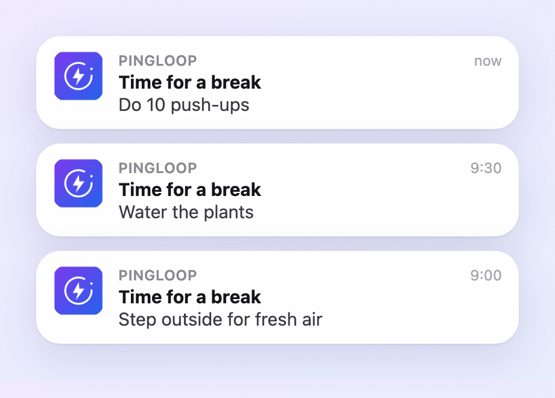

  

A tiny focus timer that pings me to take a break.

I made it for myself. I work in 30 or 60 minute blocks, and when the time is up it
nudges me to get up and do something else for a minute: water the plants, a lap through the garden, that kind of thing. Each ping suggests one.

  

It was also a nice excuse to play with a few things I had not used much: installable
PWAs, free Cloudflare Workers, and getting real notifications to show up on both my
iPhone and my desktop, even with the app closed, which was the tricky part.

  <a href="https://petervanlunteren.github.io/PingLoop/"><b>Give it a try →</b></a>

