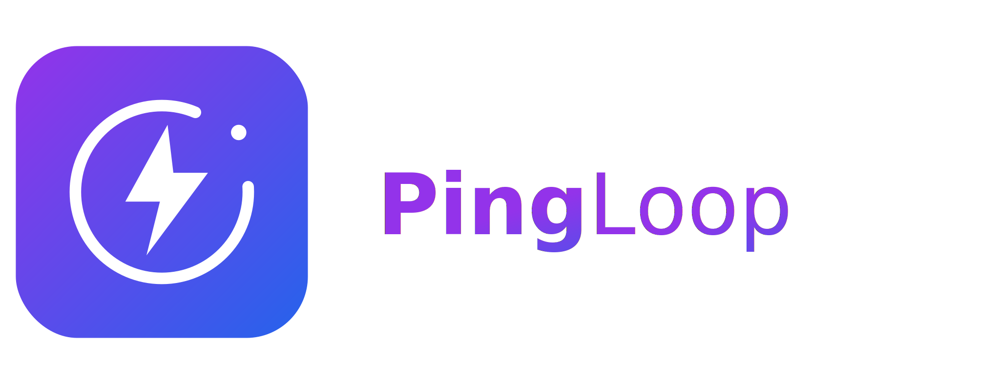
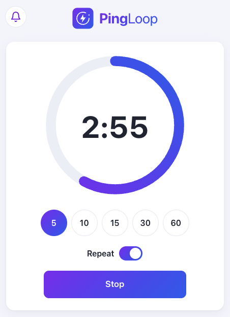

  <picture>
    <source media="(prefers-color-scheme: dark)" srcset="public/pingloop-wide-dark.svg" />
    
  </picture>

  <a href="https://petervanlunteren.github.io/PingLoop/">https://petervanlunteren.github.io/PingLoop/</a>

A tiny countdown timer that pings you when the time is up.

I built it for a very specific reason: I keep forgetting to switch between standing
and sitting at my desk, so I wanted something simple that would nudge me every
so often. That's it. Pick a length, get a ping.

It was also a nice excuse to play with a few things I had not used much: installable
PWAs, free Cloudflare Workers, and getting real notifications to show up on both my
iPhone and my desktop.

  

